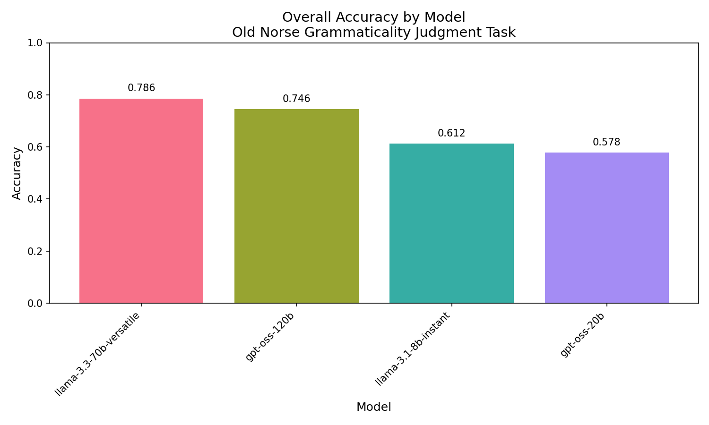
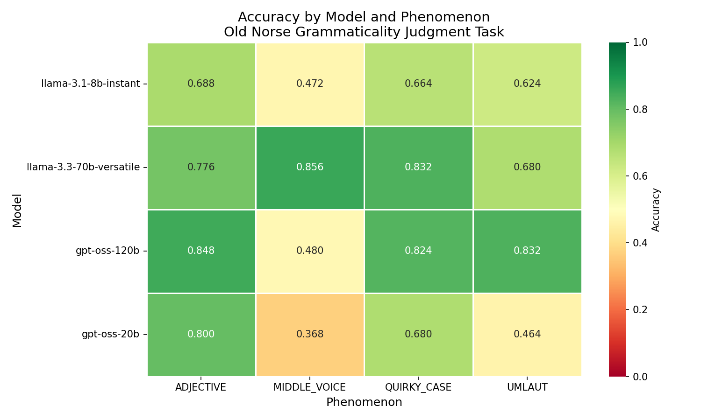

# Evaluation Results

## Executive Summary

We evaluated 4 LLMs on 500 Old Norse minimal pairs across 4 grammatical phenomena. **llama-3.3-70b-versatile achieved the highest overall accuracy (78.6%)**, followed by openai/gpt-oss-120b (74.6%). Performance varied significantly across phenomena, with MIDDLE_VOICE being the most challenging for most models.

## Overall Accuracy

| Model | Accuracy | Correct | Total |
|-------|----------|---------|-------|
| llama-3.3-70b-versatile | **0.786** | 393 | 500 |
| openai/gpt-oss-120b | 0.746 | 373 | 500 |
| llama-3.1-8b-instant | 0.612 | 306 | 500 |
| openai/gpt-oss-20b | 0.578 | 289 | 500 |

## Per-Phenomenon Accuracy

| Model | ADJECTIVE | MIDDLE_VOICE | QUIRKY_CASE | UMLAUT |
|-------|-----------|--------------|-------------|--------|
| openai/gpt-oss-120b | **0.848** | 0.480 | 0.824 | **0.832** |
| openai/gpt-oss-20b | 0.800 | 0.368 | 0.680 | 0.464 |
| llama-3.3-70b-versatile | 0.776 | **0.856** | **0.832** | 0.680 |
| llama-3.1-8b-instant | 0.688 | 0.472 | 0.664 | 0.624 |

## Per-Model Analysis

### llama-3.3-70b-versatile (Best Overall: 78.6%)
- **Strengths:** Excellent on MIDDLE_VOICE (85.6%) and QUIRKY_CASE (83.2%)
- **Weaknesses:** Lower performance on UMLAUT (68.0%)
- **Analysis:** Strong understanding of syntactic phenomena (case, voice) but struggles with morphophonological alternations

### openai/gpt-oss-120b (74.6%)
- **Strengths:** Best on ADJECTIVE (84.8%) and UMLAUT (83.2%)
- **Weaknesses:** Poor on MIDDLE_VOICE (48.0% - near chance)
- **Analysis:** Good morphological awareness but fails to recognize middle voice constructions

### llama-3.1-8b-instant (61.2%)
- **Strengths:** Relatively balanced across phenomena
- **Weaknesses:** No phenomenon above 70%
- **Analysis:** Smaller model size limits grammatical competence across all phenomena

### openai/gpt-oss-20b (57.8%)
- **Strengths:** Good on ADJECTIVE (80.0%)
- **Weaknesses:** Very poor on MIDDLE_VOICE (36.8%) and UMLAUT (46.4%)
- **Analysis:** Smaller OpenAI model shows significant degradation, especially on morphological phenomena

## Per-Phenomenon Analysis

### Difficulty Ranking (Hardest to Easiest)

1. **MIDDLE_VOICE** (Avg: 54.4%) - Most Difficult
   - Only llama-3.3-70b-versatile performs above chance
   - OpenAI models particularly struggle (36.8% - 48.0%)
   - The -sk/-st suffix may be undertokenized or unfamiliar

2. **UMLAUT** (Avg: 65.0%)
   - High variance between models (46.4% - 83.2%)
   - Requires recognizing vowel alternation patterns (a→ǫ)
   - OpenAI-120b excels, OpenAI-20b fails

3. **QUIRKY_CASE** (Avg: 75.0%)
   - Most models perform well (66.4% - 83.2%)
   - Dative subjects are unusual but learnable pattern

4. **ADJECTIVE** (Avg: 77.8%) - Easiest
   - All models above 68.8%
   - Strong/weak distinction may parallel other Germanic languages

## Key Findings

1. **Model size matters but architecture differs:** llama-3.3-70b outperforms the larger openai/gpt-oss-120b overall, suggesting architecture and training data matter more than raw size.

2. **Middle voice is uniquely challenging:** The -sk/-st reflexive suffix appears to be poorly represented in training data or tokenization.

3. **Morphophonological vs syntactic:** OpenAI models excel at morphological phenomena (ADJECTIVE, UMLAUT) while Llama excels at syntactic phenomena (QUIRKY_CASE, MIDDLE_VOICE).

4. **Smaller models degrade gracefully:** llama-3.1-8b shows balanced but lower performance, while openai/gpt-oss-20b shows catastrophic failure on specific phenomena.

## Visualizations

### Overall Accuracy

### Phenomenon Heatmap

## Implications

- LLMs have non-trivial Old Norse grammatical knowledge but significant gaps
- Middle voice constructions need better representation in training
- Low-resource language evaluation reveals model-specific weaknesses
- Morphologically rich languages remain challenging for current LLMs
